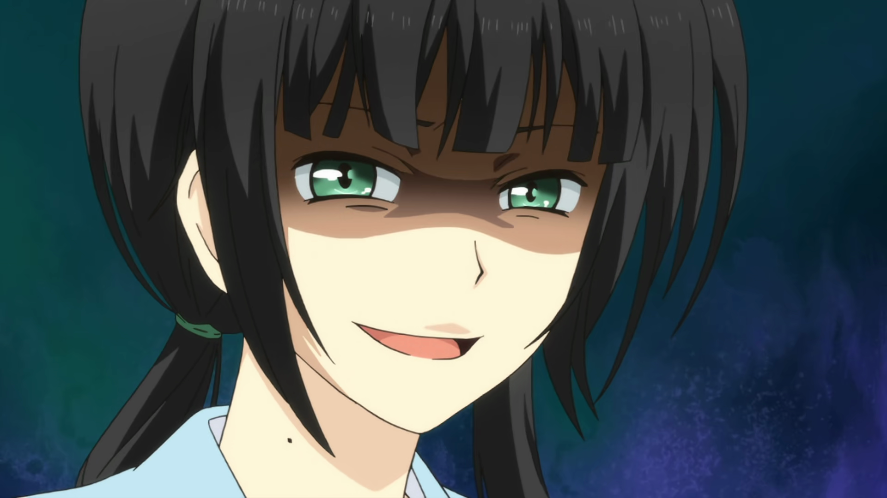

## Genel Bilgiler

- Yayın Yılı: 2016
- Stüdyo: TMS
- Bölüm: 13
- Tür: Hayattan Kesitler, Romantik, Okul

## İnceleme

Kaizaki Arata, bir baltaya sap olamamış, travmatik yetişkin hayatına uyum sağlayamamış, yıkık, mutsuz ve yalnız bir “neet”tir. Bir gece vakti, yarı uyanık yarı sarhoş, sokakta sendeleye sendeleye yürürken “ReLife” Labaratuvarları’nın bir çalışanı tarafından durdurulur ve kendisine oldukça tuhaf bir teklif sunulur: bir seneliğine liseye geri dönmek!

Ayağına gelen bu fırsatı geri tepmek istemeyen Kaizaki, teklifi kabul eder ve kendisi henüz bilmesede hayatını tümden değiştirecek bir serüvene adımını atmış olur.

Hikayenin ana teması, Kaizaki’nin bu süreçte edindiği arkadaşları ve onlarla maceraları. Tabii 27 yaşındaki bir adamın alınıp da liseye konulması pek çok komikliklere, tuhaflıklara yol açıyor. Zamanla kendini sınıfın sosyal ilişkiler danışmanı olarak bulan Kaizaki’nin sevenlerin arasını yapmasına, küskünleri barıştırmasına ve ilginç bir şekilde “ReLife” öncesi hayatının travmalarını da atlatmasına şahit oluyoruz.

Serinin bu temayı oldukça başarılı bir şekilde işlediğini söylemek mümkün. Karakterlerimizin neredeyse tümü orijinal tipler, hepsinin değişik arkaplanları, karakterleri, mizaçları var. Bunları aynı sınıfa koyduğunuzda ortaya çıkan sosyal hayat da haliyle oldukça renkli oluyor. Yazarımız bunu güzel kurgulamış. Her birinin kendilerini aşma çabalarını seyretmek oldukça keyifli. Burada eleştirilebilecek bir nokta, zaman zaman bu yan karakterlerin üzerinde fazlaca durulması ve bunun ana karakterin hikayesini gölgede bırakması.

> İnsanlarla geçinmenin mutlak bir kuralı yoktur, herkesin farklı beklentileri vardır.
>
> <cite>Kaizaki Arata</cite>

Bunun dışında işlenen yan temalar da var. Mesela iş hayatına, bu hayatın ne kadar acımasız ve çetin olduğuna, insanların nasıl birbirlerinin kuyusunu kazdığına sık sık göndermeler yapılıyor. Zaten ileride de Kaizaki’nin bu hayattan çok çektiğini öğreniyoruz.

Ayrıca hikayeye bir kaç adım geriden bakınca, tüm olanların aslında bir lise hayatı betimlemesi olduğunu fark ediyoruz. Sanki satır arasında bize şu söyleniyor: Lise, insanın kendini keşfettiği, sevmeyi ve arkadaş olmayı öğrendiği yerdir. Bu açıdan liseli okurlarımızın seriyi ayrıca beğeneceğini düşünüyorum.

Hikayenin romantizmi seviyeli bir şekilde işlemesi oldukça sevindirici, öbür türlüsü ana temaya da zıt düşerdi doğrusu. Ama hikayede rahatsız edici bulduğum noktalar da yok değil. Mesela hikayenin sonu, hikayenin en önemli dinamiklerinden birini doğrudan yok sayıyor (spoiler vermek istemiyorum), bu tutarsızlık rahatsız edici. Daha sonra Arata’nın arkaplanı, yani ReLife öncesi hayatı nedense kulağa pek gerçekçi gelmiyor, biraz dramatize edilmiş gibi. Son olarak da şu Nabunaga ile Akira ikilisi var ki, “Niye oradalar?” diye soruyor insan. Nabunaga yine anlaşılabilir, babacan, sevecen bir karakter ama Akira, ölçüsüz, sert ve aşırı koruyucu tavırlarıyla "olmasa da olurmuş" tarzda bir karakter, arkadaşlarının yanında sırıtıyor açıkçası. Sasuke'nin seslendirmeni bile kurtaramamış kendisini.

> Ne kadar güzel vakit geçirirsek, ayrıldığımızda o kadar üzüleceğiz.
>
> <cite>Hishiro Chizuru</cite>

Sanatsal açıdan çok dikkat çekici bir tarafı yok ReLife’ın. Fakat pek çok sahne “chibification” dedikleri, dilimize “sevimlileştirme” olarak çevirebileceğimiz bir çizim tarzı ile zenginleştirilmiş (altta bir örneği var). Bunun dışında ortalama bir çizim kalitesine sahip. Serinin müziklerinde enstrüman olarak daha ziyade piyano tercih edilmiş, ayrıca neredeyse tüm bitiş müzikleri birbirinden farklı, bu da dikkat çekici bir unsur.

Özetle ReLife bir lise hayatı draması. Neşeli, hüzünlü anlarıyla, tartışmaları, barışmalarıyla bize keyifli ve eğlenceli bir 12 bölüm vaadediyor. Okul animelerini seviyorsanız, biraz duygulanmak, biraz gülmek, biraz da dinlenmek istiyorsanız izlemeniz tavsiye olunur!

Yazımı okuduğunuz için teşekkür ederim!
